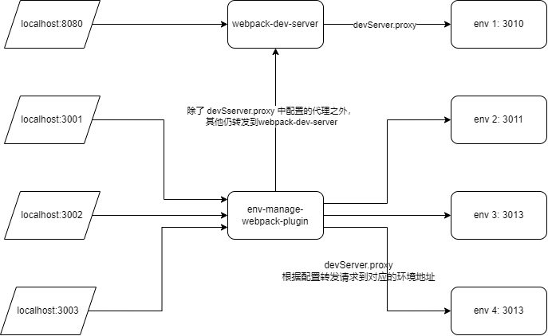

[![npm][npm]][npm-url]
[![node][node]][node-url]


# env-manage-webpack-plugin

环境管理插件

当有多个开发环境需要联调时，每次切换开发环境都需要重启 `webpack` 而通过 `env-manage-webpack-plugin` 来代理这些需要转发的请求，环境切换时只需要重启代理的服务器而不是重启整个 webpack，还可以同时启动多个代理服务器链接多个环境。

## 安装 Install

安装 env-manage-webpack-plugin

`npm i -D env-manage-webpack-plugin`

或

`pnpm i -D env-manage-webpack-plugin`

## 使用 Usage

添加 webpack 插件

**webpack.config.js**

```js
const EnvManageWebpackPlugin = require("../src");
const path = require("path");

module.exports = {
  devServer: {
    proxy: [
      {
        context: ["/simple"],
        target: "http://localhost:3010",
        changeOrigin: true,
      },
      {
        context: ["/two"],
        target: "http://localhost:3099",
        changeOrigin: true,
      },
    ],
  },
  plugins: [
    // 添加插件
    new EnvManageWebpackPlugin({
      envConfigPath: path.resolve(__dirname, "./env.config.js"),
    }),
  ],
};
```

配置完成之后，使用 `webpack server` 启动，然后访问 `/webpack-env-manage`,即可查看环境管理页面。

env-manage-webpack-plugin 共有两个配置项

- `envConfigPath`： 用于指定配置文件的位置，默认使用项目目录下的 `env.config.js`；
- `basePath`： `env-manage-webpack-plugin` 服务前缀，默认 `/webpack-env-manage`,如果和`env-manage-webpack-plugin` 的服务路径出现冲突，可通过此配置调整。

### env.config.js

```js
const getEnvConfig = () => {
  return [
    {
      name: "1号测试环境",
      target: "http://localhost:3010",
      localPort: "3001",
      index: "",
      targetMap: {
        "http://localhost:3099": "http://localhost:3020",
      },
    },
    {
      name: "222号测试环境",
      target: "http://localhost:3011",
      localPort: "3002",
    },
    {
      name: "333号测试环境",
      target: "http://localhost:3012",
      localPort: "3003",
    },
  ];
};

module.exports = getEnvConfig;
```

#### name

环境名称用于展示

#### target

环境地址，未提供时，将会忽略此条环境配置。

#### localPort

本地服务端口，未提供或者提供的端口被占用时，将会自动寻找可用端口.

#### index

首页地址 `{protocol}://{host}:{localPort}{index}`;

#### targetMap

环境中的其它服务映射,用于环境中多个 IP 情况。

例如，两个接口 `/simple` 和 `/two` 分别请求不同的 `http://localhost:3010` 和 `http://localhost:3099`，未提供 `targetMap` 时：

如果访问 webpack 启动的代理，将会正常转发到对应的服务器；

如果通过 `http://localhost:3001` 访问页面，所有请求将会被转发到 `http://localhost:3010`，提供 `targetMap`后，将会根据 `targetMap` 中的映射配置进行对应的转发。




[npm]: https://img.shields.io/npm/v/env-manage-webpack-plugin.svg
[npm-url]: https://npmjs.com/package/env-manage-webpack-plugin
[node]: https://img.shields.io/node/v/env-manage-webpack-plugin.svg
[node-url]: https://nodejs.org
